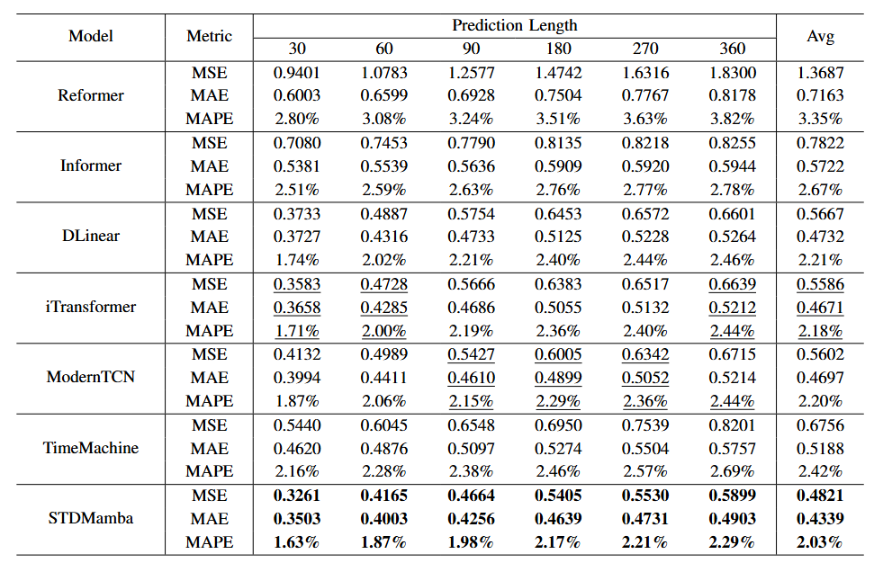
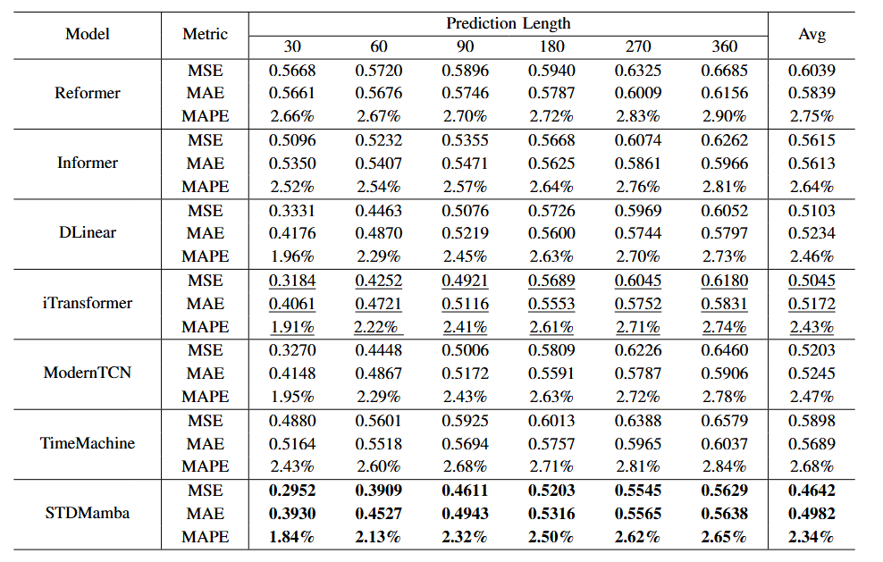

# STDMamba: Spatio-Temporal Decomposition Mamba for Long-Term Fine-Grained SST Prediction
Long-Term Fine-Grained Sea Surface Temperature Prediction based on Mamba2

# Results✅
## Main Results on the Northwest Pacific dataset

Compared to the current SOTA models, STDMamba achieves superior performance on the Northwest Pacific dataset and Indian Ocean dataset from NOAA’s publicly available Sea Surface Temperature dataset.

## Main Results on the Indian Ocean dataset

🚩**News**(February 23, 2025): We aim to replace the original bi-directional mechanism, commonly used in most time series models, with the inner bi-directional Mamba mechanism we newly proposed.

